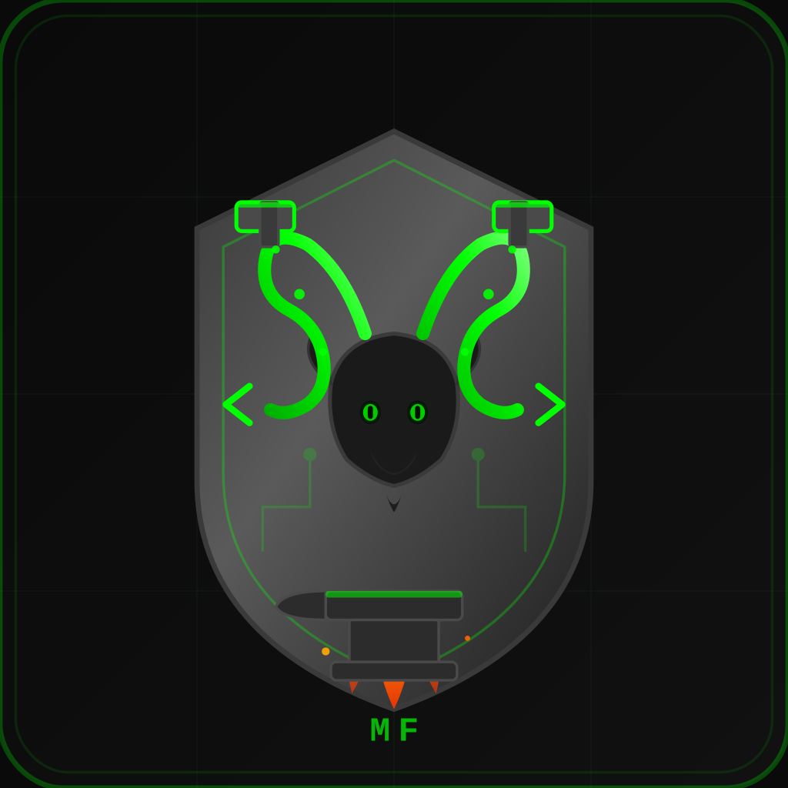

<a href="https://github.com/Athexblackhat/MARKHOR-Forge"></a> 


# 🐐 MARKHOR Forge
### Professional Penetration Testing GUI for Metasploit Framework

[](https://python.org)
[](https://riverbankcomputing.com/software/pyqt/)
[](LICENSE)
[](https://github.com/Athexblackhat/MARKHOR-Forge)
[](https://github.com/Athexblackhat/MARKHOR-Forge)

> ⚠️ **For authorized penetration testing and educational purposes only.**

---

## 📋 Table of Contents

- [Overview](#-overview)
- [Features](#-features)
- [Prerequisites](#-prerequisites)
- [Installation](#-installation)
- [Quick Start](#-quick-start)
- [User Guide](#-user-guide)
- [Keyboard Shortcuts](#️-keyboard-shortcuts)
- [Configuration](#️-configuration)
- [Troubleshooting](#-troubleshooting)
- [Contributing](#-contributing)
- [License](#-license)

---

## 🎯 Overview

**MARKHOR Forge** is a comprehensive graphical interface for the Metasploit Framework, designed to streamline penetration testing workflows. Built with PyQt5, it provides an intuitive dark-themed GUI for security professionals and learners.

Key capabilities include:

- Network reconnaissance and scanning
- Exploit selection and execution
- Payload generation with `msfvenom`
- Session management and interaction
- Post-exploitation activities
- Automated reporting and assessment tracking

---

## ✨ Features

### 🚀 Core Features

| Feature | Description |
|---|---|
| Metasploit Integration | RPC API and console mode support |
| Network Scanning | Integrated Nmap scanner with multiple scan types |
| Exploit Management | Categorized exploit tree with search and favorites |
| Payload Generation | Full `msfvenom` support with encoding options |
| Session Manager | Interactive tabs for multiple Meterpreter sessions |
| Post-Exploitation | File browser, command execution, system info |

### 🔧 Advanced Features

- **Auto-Exploit Engine** — Automatically suggests exploits based on scan results
- **Vulnerability Database** — Searchable CVE database with exploit mappings
- **Assessment Management** — Track findings and generate professional reports
- **Multi-Target Support** — Scan and exploit multiple targets simultaneously
- **Web Server Simulator** — Test exploits in a controlled lab environment
- **System Monitor** — Real-time CPU, memory, and process monitoring
- **Credential Manager** — Secure storage for test credentials
- **Report Generator** — Export findings in HTML, JSON, or text formats

### 🎨 User Interface

- Modern dark theme with terminal aesthetics
- Sidebar navigation with icons
- Tabbed interface for easy workflow management
- Real-time terminal output
- System tray integration
- Animated splash screen with popup notifications

---

## 📦 Prerequisites

### Required

- **Python 3.7+**
- **PyQt5** — `pip install PyQt5`
- **Metasploit Framework** — [Installation Guide](https://docs.metasploit.com/)

### Optional but Recommended

- **Nmap** — Network scanning capabilities
- **msfvenom** — Payload generation (included with Metasploit)
- **psutil** — System monitoring features

### Supported Platforms

- 🐧 Linux (Kali Linux, Ubuntu, Debian)
- 🍎 macOS (with Metasploit)
- 🪟 Windows 10/11 (with WSL or native Metasploit)

---

## 🔧 Installation

### 1. Clone the Repository

```bash
git clone https://github.com/Athexblackhat/MARKHOR-Forge.git
cd MARKHOR-Forge
```

### 2. Install Python Dependencies

```bash
# Required
pip install PyQt5

# Optional extras
pip install psutil msfrpc
```

### 3. Install Metasploit Framework

**Kali Linux** (pre-installed):
```bash
msfconsole --version
```

**Ubuntu / Debian:**
```bash
curl https://raw.githubusercontent.com/rapid7/metasploit-omnibus/master/config/templates/metasploit-framework-wrappers/msfupdate.erb > msfinstall
chmod 755 msfinstall
./msfinstall
```

**macOS:**
```bash
brew install metasploit
```

**Windows:** Download from [Rapid7](https://www.rapid7.com/products/metasploit/download/)

### 4. Install Nmap (Optional)

```bash
# Linux
sudo apt-get install nmap

# macOS
brew install nmap

# Windows — Download from https://nmap.org/download.html
```

### 5. Verify Installation

```bash
python -c "import PyQt5; print('PyQt5 OK')"
msfconsole --version
nmap --version
```

---

## 🚀 Quick Start

### 1. Launch the Application

```bash
python markhor_cyber_lab.py
```

### 2. Connect to Metasploit

The application will automatically attempt to connect to Metasploit. If using RPC mode, ensure `msfrpcd` is running. If using console mode, `msfconsole` will start automatically.

### 3. Basic Workflow

```
1. Scanner Tab    →  Enter target IP → Run Quick/Full Scan
2. Exploit Tab    →  Browse categories or use Auto-Suggest
3. Configure      →  Set RHOSTS, RPORT, and other options
4. Run Exploit    →  Click "Run Exploit"
5. Payload Tab    →  Generate and transfer payload to target
6. Sessions Tab   →  Interact with active Meterpreter sessions
7. Report Tab     →  Export findings as HTML or JSON
```

---

## 📚 User Guide

### Dashboard

Provides a real-time overview of: Metasploit connection status, active session count, system information, and quick action shortcuts.

### Scanner Module

| Scan Type | Description |
|---|---|
| Quick Scan | Top 1000 ports with version detection |
| Full Scan | All ports with service detection and vuln scripts |
| Multi-Target | Scan multiple IPs from a list |
| Auto-Suggest | Recommends exploits based on scan results |

### Exploit Module

- **Categories:** Windows, Linux, Multi, Web, Local
- **Search:** Filter exploits by name or CVE
- **Favorites:** Save frequently used exploits
- **Auto-Exploit:** Automated exploitation based on target profile

### Payload Module

| Option | Choices |
|---|---|
| Payload Types | Windows, Linux, Android, Java, PHP, Python |
| Formats | EXE, ELF, Python, PowerShell, VBS, C, Java, PHP |
| Encoders | Shikata ga nai, Alpha Mixed, and more |

Includes template support and a command preview before execution.

### Sessions Module

- Interactive tabbed windows per session
- Command history (↑/↓ navigation)
- Background, kill, or interact with sessions
- Full shell access on compromised systems

### Post-Exploit Module

- System info: hostname, OS, user, network interfaces
- Remote file browser with upload/download
- In-session command execution

### Assessment Module

- Organize tests by project
- Log vulnerabilities with severity levels (Critical / High / Medium / Low)
- Document remediation steps
- Export professional reports

### Vulnerability Database

- Search by CVE ID or description
- Exploit mapping to Metasploit modules
- Severity ratings and remediation recommendations

### Web Server Simulator

A controlled lab environment featuring vulnerable endpoints for practice, including Shellshock and file upload vulnerabilities. Supports custom port configuration.

---

## ⌨️ Keyboard Shortcuts

| Shortcut | Action |
|---|---|
| `Ctrl+Q` | Quit application |
| `Ctrl+R` | Generate report |
| `Ctrl+D` | Clear terminal |
| `Ctrl+S` | Save configuration |
| `F5` | Refresh current view |
| `F1` | Show help |
| `Tab` | Auto-complete in terminal |
| `↑` / `↓` | Navigate command history |

---

## ⚙️ Configuration

### Configuration File Location

| Platform | Path |
|---|---|
| Linux | `~/.config/MARKHOR/CyberLab.conf` |
| Windows | `%APPDATA%\MARKHOR\CyberLab.conf` |
| macOS | `~/Library/Preferences/MARKHOR/CyberLab.conf` |

### Command Line Arguments

```bash
python run.py [OPTIONS]

  --no-splash    Disable splash screen
  --debug        Enable debug logging
  --config FILE  Load configuration from FILE
```

### Environment Variables

```bash
# Metasploit RPC credentials
export MSF_RPC_USER="your_username"
export MSF_RPC_PASS="your_password"
export MSF_RPC_PORT="55553"

# Custom paths
export MSF_PATH="/usr/share/metasploit-framework"
export NMAP_PATH="/usr/bin/nmap"
```

---

## 🔍 Troubleshooting

### PyQt5 Import Error

```
Error: PyQt5 not installed
```
```bash
pip install PyQt5
```

### Metasploit Connection Failed

```
[!] Failed to connect: Connection refused
```
- Start the RPC service: `msfrpcd -P msf -U msf`
- Verify installation: `msfconsole --version`
- Check firewall: `ufw allow 55553`

### Nmap Not Found

```
[!] Warning: nmap not found in PATH
```
```bash
sudo apt-get install nmap   # Debian/Ubuntu
brew install nmap            # macOS
```

### Payload Generation Failed

```
[!] msfvenom not found
```
Ensure Metasploit Framework is fully installed (msfvenom is included).

### Permission Denied

```
Permission denied: /tmp/payload.exe
```
Run with appropriate permissions or change the output directory in settings.

### Log Files

| Platform | Log Path |
|---|---|
| Linux | `/var/log/markhor/` or `~/markhor.log` |
| Windows | `C:\ProgramData\MARKHOR\logs\` |
| macOS | `~/Library/Logs/MARKHOR/` |

Enable verbose logging:
```bash
python run.py --debug
```

---

## 🤝 Contributing

Contributions are welcome! Please follow these steps:

```bash
# 1. Fork the repository and clone it
git clone https://github.com/Athexblackhat/MARKHOR-Forge.git
cd MARKHOR-Forge

# 2. Create a virtual environment
python -m venv venv
source venv/bin/activate       # Linux/macOS
venv\Scripts\activate          # Windows

# 3. Install development dependencies
pip install -r requirements.txt

# 4. Create a feature branch
git checkout -b feature/your-feature-name

# 5. Make changes, then commit
git commit -m "Add: your feature description"

# 6. Push and open a Pull Request
git push origin feature/your-feature-name
```

### Code Style Guidelines

- Follow [PEP 8](https://pep8.org/) conventions
- Use meaningful, descriptive variable names
- Add docstrings to all functions and classes
- Include type hints where possible
- Run tests before submitting: `python -m pytest tests/`

---

## 📄 License

**Educational & Authorized Testing Use Only**

This software is intended for educational purposes and authorized security assessments only.

| Permitted | Not Permitted |
|---|---|
| ✅ Learning about security testing | ❌ Unauthorized access to systems |
| ✅ Authorized penetration testing | ❌ Illegal or malicious activities |
| ✅ Security research in lab environments | ❌ Redistribution without attribution |

The authors are not responsible for any misuse or damage caused by this software. See the [LICENSE](LICENSE) file for full terms.

---

<div align="center">

Made with ❤️ by **MARKHOR (TEAM ATHEX)**

Programmed by **ATHEX BLACK HAT** — Team Athex Leader

*With great power comes great responsibility. Use this tool ethically.*

</div>
